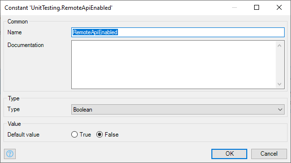
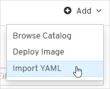
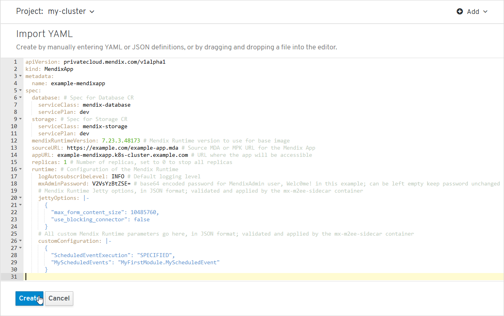

## 1 Introduction

Once you have the Mendix Operator installed in a namespace of your Kubernetes Red Hat OpenShift, AWS-EKS, or AKS cluster (see [Creating a Private Cloud Cluster](private-cloud-cluster)), you can use it to control the deployment of your Mendix app using Mendix Custom Resources (CRs). The Mendix operator then creates the app container and builds the app inside the namespace, together with all the resources the app needs.

This document explains how to provide the CRs through the console or command line for a standalone cluster. This enables you to automate your deployment processes and perform deployments from behind a firewall which would prevent access to the Mendix Developer Portal.

Alternatively, you can create a connected cluster and use the Mendix Developer Portal to deploy the app, as described in [Deploying a Mendix App to a Private Cloud Cluster](private-cloud-deploy).

## 2 Prerequisites for Deploying a Mendix App

* A Kubernetes, AWS-EKS, AKS, or OpenShift (version 3.11 or above) platform
* Platform administration account
* **OpenShift CLI** installation if you are deploying on OpenShift (see [Getting started with the CLI](https://docs.openshift.com/container-platform/4.1/cli_reference/getting-started-cli.html) on the Red Hat OpenShift website for more information)
* **Kubectl** installation if you are deploying to another Kubernetes platform (see [Install and Set Up kubectl](https://kubernetes.io/docs/tasks/tools/install-kubectl/) on the Kubernetes webside for more information)
* **Bash** (Bourne-again shell) for your machine. If you are running on Windows, you can use something like [**Windows Subsystem for Linux (WSL)**](https://docs.microsoft.com/en-us/windows/wsl/faq) or the **Git Bash emulator** that comes with [git for windows](https://gitforwindows.org/).
* The **deployment package** of a Mendix app made with version 7.23.3 (build 48173) or above

## 3 Deploying a Mendix App with an Operator

You can deploy multiple Mendix apps to run in the same Kubernetes or OpenShift namespace. This means that they need to have unique and recognizable names; the name is required to identify the app when creating/modifying/deleting it.

Follow the instructions below to deploy your app.

### 3.1 Creating a Deployment Package

Create a deployment package (.mda) file from your app. It is this which is picked up by the CR configuration and deployed in a container to your namespace.

You can obtain the deployment package in a number of ways:

* within Studio, by choosing the menu option **Project > Create Deployment Package…**
* from the **Environments** page of your app in the Developer Portal
* through a CI/CD process, such as Jenkins.

The deployment package must be available over the internet without requiring authorization credentials, as these cannot be provided in the CR.

### 3.2 Editing the CR{#edit-cr}

You need to create a file containing the following yml code and then configure it to create the CR for your app:

```yml
apiVersion: privatecloud.mendix.com/v1alpha1
kind: MendixApp
metadata:
  name: example-mendixapp
spec:
  database: # Specification of Database CR
    serviceClass: mendix-database
    servicePlan: dev
  storage: # Specification of Storage CR
    serviceClass: mendix-storage
    servicePlan: dev
  mendixRuntimeVersion: 7.23.3.48173 # Mendix version to use for placeholder runtime image
  sourceURL: https://example.com/example-app.mda # URL of App's source MDA or MPK
  appURL: example-mendixapp.k8s-cluster.example.com # URL to access the app
  replicas: 1 # Number of replicas, set to 0 to stop all replicas
  resources: # Optional, can be omitted : set resources for Mendix Runtime container 
    limits: # Upper limit - process will be stopped if it tries to use more
      cpu: 500m # 500 millicores - half of a vCPU
      memory: 512Mi # 512 megabytes - suitable for small-scale non-production apps
    requests: # Lower limit - needs at least these resources
      cpu: 250m
      memory: 256Mi
  runtime: # Configuration of the Mendix Runtime
    logAutosubscribeLevel: INFO # Default logging level
    mxAdminPassword: V2VsYzBtZSE= # base64 encoded password for MendixAdmin user. In this example, 'Welc0me!'; can be left empty keep password unchanged
    dtapMode: P # Security & runtime mode: P for production, D for development
    # Mendix Runtime Jetty options, in JSON format; validated and applied by the mx-m2ee-sidecar container
    jettyOptions: |-
      {
        "max_form_content_size": 10485760,
        "use_blocking_connector": false
      }
    # All custom Mendix Runtime parameters go here, in JSON format; validated and applied by the mx-m2ee-sidecar container
    customConfiguration: |-
      {
        "ScheduledEventExecution": "SPECIFIED",
        "MyScheduledEvents": "MyFirstModule.MyScheduledEvent",
        "MicroflowConstants":"{\"MyFirstModule.Constant\":\"1234\",\"Atlas_UI_Resources.Atlas_UI_Resources_Version\":\"2.5.4\"}"
      }
```

You need to make the following changes:

* **name**: – You can deploy multiple apps in one project/namespace — the app name in the CR doesn't have to match the app name in the mda but must be unique in the project — see [Reserved Names for Mendix Apps](#reserved-names), below, for restrictions on naming your app
* **database/storage**: – ensure that these have the correct **servicePlan** — they have to have the same names that you registered in the namespace
* **mendixRuntimeVersion**: – the full runtime version which matches the mda, including the build number
* **sourceURL**: – the location of the deployment package, this must be accessible from your cluster without any authentication
* **appURL**: – the endpoint where you can connect to your running app — this is optional, and if it is supplied it must be a URL which is supported by your platform
* **replicas**: – by default one replica will be started when you deploy your app
* **resources**: – here you can change the minimum and maximum container resources your app requires
* **logAutosubscribeLevel**: – change the default logging level for your app, the standard level is INFO — possibilities are: `TRACE`, `DEBUG`, `INFO`, `WARNING`, `ERROR`, and `CRITICAL`
* **mxAdminPassword**: – here you can change the password for the MxAdmin user — if you leave this empty, the password will be the one set in the Mendix model
* **dtapmode**: – For development of the app, for example acceptance testing, choose **D**, for production deployment, select **P**

    If you select production, then you will need to provide a **Subscription Secret** to ensure that your app runs as a licensed app — see [Free Apps](mendix-cloud-deploy#free-app) in *Mendix Cloud* for the differences between free/test apps and licensed apps
    
    the subscription secret needs to be supplied via the **customConfiguration** using the following values:

    * `"License.SubscriptionSecret":"{subscription secret}"`
    * `"License.UseLicenseServer":"true"`
    * `"License.LicenseServerURL":<https://subscription-api.test.mendix.com/activate>`
    * `"License.EnvironmentName":"{environment name}"`

    {}Your app can only be deployed to a production environment if [security in the app is set on](/refguide/project-security). {}

    If you have an offline license, you cannot provide it through **customConfiguration**. You will need to configure it by adding a **runtimeLicense** section within the **runtime** section and setting **LicenseId** and **LicenseKey** to the values received from Mendix Support:

    ```yaml
    apiVersion: privatecloud.mendix.com/v1alpha1
    kind: MendixApp
    metadata:
      name: example-mendixapp
    spec:
      runtime:
        # add this section to the existing runtime configuration
        runtimeLicense: # Mendix Runtime License configuration
          type: offline # Set to offline
          id: LicenseId # Offline LicenseId (UUID) value provided by Mendix Support
          key: LicenseKey # Offline LicenseKey value provided by Mendix Support
    ```

* **jettyOptions** and **customConfiguration**: – if you have any custom Mendix Runtime parameters, they need to be added to this section — options for the Mendix runtime have to be provided in JSON format — see the examples in the CR for the correct format and the information below for more information on [setting app constants](#set-app-constants) and [configuring scheduled events](#configure-scheduled-events)

#### 3.2.1 Setting App Constants{#set-app-constants}

To set constant values, first create a key-value JSON with values for each constant.

The constant name is equal to `{module-name}.{constant-name}` where {module-name} is the name of the Mendix app module containing the constant,
and {constant-name} is the name of the constant. The constant name will also be visible in the constant properties (UnitTesting.RemoteApiEnabled in this example):



For example, to set the `MyFirstModule.Constant` constant to `1234` and `MyModule.AnotherConstant` to `MyValue`, create the following JSON:
```json
{"MyFirstModule.Constant":"1234","MyModule.AnotherConstant":"true"}
```

Next, convert this JSON into a string by escaping it (in particular, replacing all `"` characters with `\"`) and use it as the **MicroflowConstants** value in **customConfiguration**. For example:
```yaml
apiVersion: privatecloud.mendix.com/v1alpha1
kind: MendixApp
metadata:
  name: example-mendixapp
spec:
  runtime:
    # Add the MicroflowConstants value here
    customConfiguration: |-
      {
        "MicroflowConstants":"{\"MyFirstModule.Constant\":\"1234\",\"MyModule.AnotherConstant\":\"true\"}"
      }
```

#### 3.2.2 Configuring Scheduled Events{#configure-scheduled-events}

To disable execution of all scheduled events, set the **ScheduledEventExecution** value to `NONE` in **customConfiguration**.

To enable execution of all scheduled events, set the **ScheduledEventExecution** value to `ALL` in **customConfiguration**.

To enable execution for specific scheduled events, set the **ScheduledEventExecution** value to `SPECIFIED` in **customConfiguration**.
Specify which events should be enabled by listing their full names in the **MyScheduledEvents** value in **customConfiguration**.

For example, to enable the execution of event `EventOne` in module `MyFirstModule` and event `EventTwo` in `MySecondModule`,
set the **MyScheduledEvents** value to `MyFirstModule.EventOne,MySecondModule.EventTwo`:

```yaml
apiVersion: privatecloud.mendix.com/v1alpha1
kind: MendixApp
metadata:
  name: example-mendixapp
spec:
  runtime:
    customConfiguration: |-
      {
        "ScheduledEventExecution":"SPECIFIED",
        "MyScheduledEvents":"MyFirstModule.EventOne,MySecondModule.EventTwo"
      }
```

The **MyScheduledEvents** value should be removed from **customConfiguration** if **ScheduledEventExecution** is set to `ALL` or `NONE`.

### 3.3 Building and Deploying Your App

You now need to supply the CR you have just created to the platform so that the Mendix Operator can use it to build and deploy the app.

You can do this in one of two ways:

* via the CLI
* for OpenShift, you can use the [OpenShift console](#openshift-console)

#### 3.3.1 Processing the CR in the CLI

 To submit the CR via a CLI you will need a file containing the YML you created in [Editing the CR](#edit-cr), above.

##### 3.3.1.1 Kubectl in the CLI

To build and deploy your app using AWS-EKS or other Kubernetes platform execute the following command:

```bash
kubectl apply -f {File containing the CR} -n {namespace where app is being deployed}
```

##### 3.3.1.1 OpenShift CLI

To build and deploy your app using the OpenShift CLI, do the following:

1.  Paste the OpenShift login command into Bash as described in the first few steps of the [Signing in to Open Shift](private-cloud-cluster#openshift-signin) section of *Creating a Private Cloud Cluster*.
2.  Switch to the project where you've deployed the Mendix Operator using the command`oc project {my-project}` where {my-project} is the name of the project where the Mendix Operator is deployed.
3.  Paste the following command into Bash:

```bash
oc apply -f {File containing the CR}
```

#### 3.3.2 Process the CR in the OpenShift Console{#openshift-console}

To build and deploy your app using the OpenShift Console, do the following:

1.  Sign in to the OpenShift Console.

1.  Go to your project.

2.  Click the **Add** button, and select **Import YAML**.
    
    

3.  In the **Import YAML** page, enter/paste the YML you prepared in [Editing the CR}(#edit-cr), above.

4.  Click the **Create** button.
    
    

Mendix Operator will now pick up the YAML and deploy your app.

### 3.4 Monitoring the Build Process.

The YAML window will report the status of the app build. Note that it can take up to ten minutes for all the statuses to reach ready.

The following statuses will be reported:

* **appState** – The status of your app (Started or Stopped)
  * This will also return the **appURL** which you can use to reach your app
* **buildStatus** – Ready
* **databaseStatus** – Ready
* **mendixAppState** – Ready
* **networkStatus** – Ready
* **runtimeStatus** – Ready
* **storageStatus** – Ready

### 3.5 Starting and Stopping Your App

You can start and stop your app through the CR you supplied to deploy your app. See section [Edit the CR](#edit-cr), above, for the full CR.

To stop your app when it is running, set the value of **replicas** to zero.

To start your app when it is stopped, set the value of **replicas** to be non-zero.

The value set in **replicas** will only be applied once the runtime status is **Ready**. If the runtime is waiting for another action to complete (for example, provisioning the database), then it will apply the replicas value once all other actions have been completed.

## 4 Current Limitations

### 4.1 Reserved Names for Mendix Apps{#reserved-names}

Names beginning **mendix-** cannot be used for your own apps as they are reserved for use by the Mendix Operator.

All names beginning **openshift-** are reserved for use by OpenShift if you are deploying to an OpenShift cluster.
